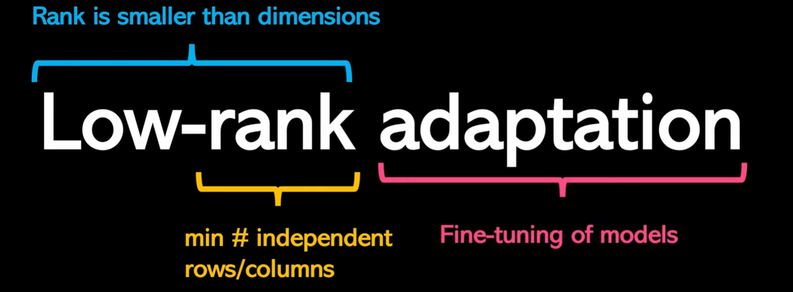
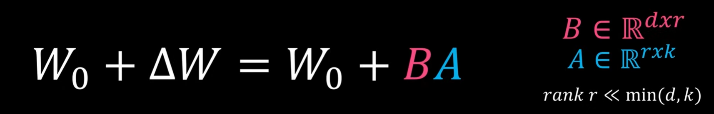
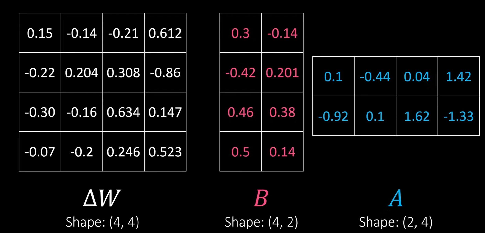

# Navigating-the-Rulespace
Capstone Project collaborated with Bloomberg Government

## 🔎 Executive Summary
- **Problem Statement**:
    - Context: Legal documents—bills, laws, statutes—are core to judicial decisions, legislative drafting, and legal advocacy.

    - Problem: These documents depend on citations to prior authorities, but current tools indicate where citations occur, not what role they play in the argument.
      
    - Gap: The semantic function of a citation (e.g., support, limitation, contrast, extension, exception) is rarely captured, making deep understanding and retrieval difficult at scale.
      
    - Impact of the Gap: Researchers must manually interpret citation intent, slowing analysis, obscuring precedent relationships, and increasing the risk of missed nuances.
      
    - Why Now: Rapidly evolving policy landscapes amplify the need for precise, explainable links between new texts and historical authorities.
      
    - Users Affected: Judges, legislators, attorneys, policy analysts, and legal researchers who rely on accurate, timely interpretation of authorities.
      
    - Objective: Identify and label the semantic role of each citation within legal texts to reveal argument structure and precedent usage.
      
    - Outcome: Faster, more accurate retrieval and analysis; clearer navigation of complex policy; improved summaries and decision support.

Alignment: Directly supports Bloomberg Government’s mission to help users navigate complex, fast-changing policy environments with confidence.
- **Data**: Bloomberg Government provided a curated set of congressional bills and inline citations (≈108 bills, 17k+ citations).  
- **Solution**: Multi-stage ground-truth pipeline, then comparative modeling, and a lightweight chatbot configured in Azure AI Foundry.  
- **Highlights**
  - **Label quality**: Created the ground truth labeling process - manual + LLM +  ML training
  - **Classification**: Created an end to end ML classification pipeline to compare the performance across mulitple metrics.
  - **Analyst workflow**: Helped legal analyst by reduving manual review time.

## 📦 Data & Label Taxonomy
- **Source**: Congressional bills with inline citations provided by sponsor.  
- **Target Labels (5)**: `Authority`, `Amending`, `Definition`, `Exception`, `Precedent`.  
- **Schema**: `(bill_id, section_id, citation_text, context_pre, context, context_post, jurisdiction, year, metadata…)`  
- **Normalization**: regex cleanup, unicode fixes, citation normalization, etc.

---

## 🏷️ Ground-Truth Generation 
1) **Expert gold**: **~20%** of corpus manually annotated by legal analysts. 
2) **LLM seeding**: prompt based classification with Meta **LLaMA** propose a label + short rationale.  
   - After generating goes thorugh a review process of expert in the loop.
   - Accepted items become silver labels. Rationales are **not used** at inference time.
3) **LLM + expert verify**: **~35%** labeled using LLM and with **legal expert in the loop** to validate/rectify.  
4) **Model-assisted + expert verify**: Train **Legal RoBERTa** on the first **~55%**; label the remaining **~45%** using model's prediciton which are again gone though expert verification process

   

5) **Class balance**: **SMOTE** on sentence embeddings + **frozen adapters** for stable training batches.

---

## 🧪 Models & Training
- **Transformers**: **LegalBERT**, **DistilBERT**.  
- **Graph context**: **GCN** over a citation graph (nodes=citations; edges=co-mentions) using encoder embeddings + simple structural features.

  
- **Fine-tuning**: **LoRA** adapters for parameter-efficient updates (fast iteration on modest GPUs).  
- **Splits**: Held-out by bill and year to avoid near-duplicate leakage.  
- **Metrics**: Accuracy, macro-Precision/Recall/F1; per-class confusion matrices.

  ## 🏷️ For fine tuning, I have used LoRA that is called Low-Rank Adaptation.
  

  LoRA reduces the number of trainable parameters by learning pairs of rank-decompostion matrices while freezing the original weights. This vastly reduces the storage requirement for large language models adapted to specific tasks and      enables efficient task-switching during deployment all without introducing inference latency. The decomposition of ΔW means that we represent the large matrix ΔW with two smaller LoRA matrices, A and B. If A has the same number of rows   as ΔW and B has the same number of columns as ΔW, we can write the decomposition as ΔW = AB. (AB is the matrix multiplication result between matrices A and B.) 

  In mathematical form, LoRA is written in:

  

  Lets take a small example:

  

  Lets scale it more:

  

  How much memory does this save? It depends on the rank r, which is a hyperparameter. For example, if ΔW has 10,000 rows and 20,000 columns, it stores 200,000,000 parameters. If we choose A and B with r=8, then A has 10,000 rows and 8     columns, and B has 8 rows and 20,000 columns, that's 10,000×8 + 8×20,000 = 240,000 parameters, which is about 830× less than 200,000,000.

  Of course, A and B can't capture all the information that ΔW could capture, but this is by design. When using LoRA, we hypothesize that the model requires W to be a large matrix with full rank to capture all the knowledge in the          pretraining dataset. However, when we finetune an LLM, we don't need to update all the weights and capture the core information for the adaptation in a smaller number of weights than ΔW would; hence, we have the low-rank updates via AB.

  Here are some of the performance metrics shown as a part of confusion matrix. Thorugh the confusion matrix we can calculate Accuracy, Precision, Recall, F1-score. I can show a confusion matrix of the baseline transformer models.
  
  LegalBERT:
  

  DistilBERT:
  
  
---

## 📊 Key Results
| Area | Result |
|---|---|
| Classification (overall avg - baseline + finetune) | **~92% accuracy**, **~0.91 macro-F1**, **~93% precision**. |
| Comparative | LegalBERT + LoRA strongest single model, then DistilBERT + LoRA the next strongest, then baselime LegalBERT, then baseline DistilBERT, next GCN-fine tune, last GCN |

**Model snapshot**  
- **LegalBERT**: Best performance. Consistent performance across all performance metrics: accuracy (95%), precision (95%), recall (95%), macro-f1 score (95%)
- **DistilBERT**: Good Performance. At ~97% of LegalBERT quality at lower latency.  
- **GCN**: Decent performance acorss all performance metrics: accuracy (85%), precision (87%), recall (85%), macro-f1 score (89%).

## 🧰 RAG Assistant (Azure AI Foundry, no-code)
**Goal**: Let analysts paste a bill context + citation and receive a **grounded label** with supporting span.  
**Stack**: Azure **Blob Storage** ->  **Text Embeddings** -> **AI Search** (hybrid index) -> **GPT-4o** (playground) with a strict system prompt.

**Steps**
1. Create **Resource Group** -> **Storage Account** -> **Blob Container**; upload documents + labeled dataset.  
2. Deploy **Text Embedding** model in **Azure AI Foundry**.  
3. Create **Azure AI Search** service, connect Blob data source, chunk & vectorize, build hybrid index.  
4. Deploy **GPT-4o** in Foundry, connect to AI Search as data source.  
5. Author system + user prompts to: (a) map to {Authority, Amending, Definition, Exception, Precedent}, (b) return a rationale of why this particular label.

## 🏷️RAG evaluation

We evaluated legal analyst's RAG answers on 200 examples. There were 4 features: question, answer, contexts, ground_truth. I used **RAGAS** to evaluate the answer of the RAG with two metrics:

- **Faithfulness**: This metric measures the factual consistency of the generated answer against the given context. It is calculated from the answer and retrieved context. The answer is scaled to a range of 0 or 1, with higher values        indicating  better consistency.
   In easier terms, this is how **Faithfulness** can be described as a question: Does the generated `answer` appear in the retrieved `contexts`? Yes (1) or No (0).

- **Answer Correctness**: This metric measures the semantic similarity of the generated answer against the given gorund truth. It is calculated from the answer and ground truth. The answer is scaled to a range of 0 to 1 (answer is in decimals -   for example - 0.7689). A higher score indicates a closer alignment between the generated answer and the ground truth, signifying better correctness.
  In easier terms, this is how **Answer Correctness** can be described as a question: Does the generated `answer` semantically match with the `ground_truth`? The score gives between 0 and 1.

## 📄 Notes 
1. SMOTE is used only within training batches, monitor calibration and minority-class overfitting.
2. LLM rationales are for label creation only, never surfaced to end users.

## 📂 TLDR 
1. Built a staged labeling pipeline (LLM seeding → expert verify → model-assisted) that increased usable-label precision by ~18%. Final labeled set created with 20% expert gold, 35% LLM + expert verify, 45% model-assisted + expert verify.
2. Fine-tuned LegalBERT, DistilBERT, and a GCN (Basic trianing SMOTE + basic adapters and LoRA adapters).
3. RAG assistant in Azure AI Foundry wired to Azure AI Search and GPT-4o. Analysts paste a bill context + citation and receive a grounded label with its perspective ratioanle.

## 🙌 Acknowledgements
Thanks to **Bloomberg Government** mentors and Virginia Tech faculty for guidance and evaluation support.
"""
