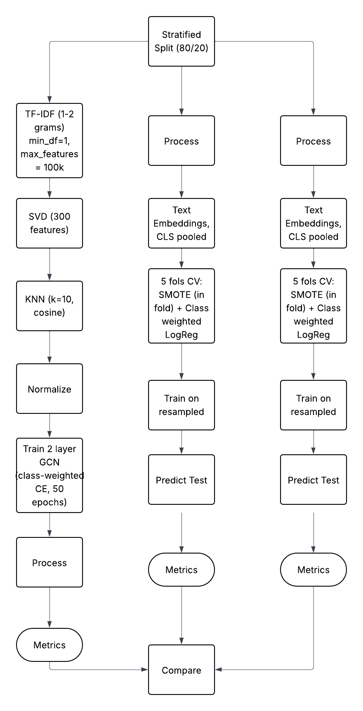
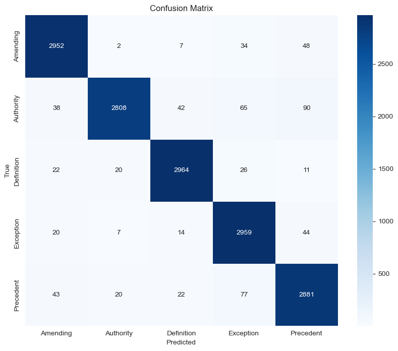

# Navigating-the-Rulespace
Capstone Project collaborated with Bloomberg Government

## 🔎 Executive Summary
- **Data**: Bloomberg Government provided a curated set of congressional bills and inline citations (≈108 bills, 17k+ citations).  
- **Challenge**: No gorund truth labels; strong class imbalance.  
- **Solution**: Multi-stage ground-truth pipeline, then comparative modeling, and a lightweight chatbot configured in Azure AI Foundry.  
- **Highlights**
  - **Label quality**: Created the ground truth labeling process - manual + LLM +  ML training
  - **Classification**: Created an end to end ML classification pipeline to compare the performance across mulitple metrics.
  - **Analyst workflow**: Helped legal analyst by reduving manual review time.

## 📦 Data & Label Taxonomy
- **Source**: Congressional bills with inline citations provided by sponsor.  
- **Target Labels (5)**: `Authority`, `Amending`, `Definition`, `Exception`, `Precedent`.  
- **Schema**: `(bill_id, section_id, citation_text, context_pre, context, context_post, jurisdiction, year, metadata…)`  
- **Normalization**: regex cleanup, unicode fixes, citation canonicalization, and 2–3 sentence context windows.

---

## 🏷️ Ground-Truth Generation 
1) **Expert gold**: **~20%** of corpus manually annotated by legal analysts. 
2) **LLM seeding**: chain-of-thought prompt based classification with Meta **LLaMA** propose a label + short rationale.  
   - After generating goes thorugh a review process of expert in the loop.
   - Accepted items become silver labels. Rationales are **not used** at inference time.
3) **LLM + expert verify**: **~35%** labeled using LLM and with **legal expert in the loop** to validate/rectify.  
4) **Model-assisted + expert verify**: Train **Legal RoBERTa** on the first **~55%**; label the remaining **~45%** using model's prediciton which are again gone though expert verification process

   

5) **Class balance**: **SMOTE** on sentence embeddings + **frozen adapters** for stable training batches.

---

## 🧪 Models & Training
- **Transformers**: **LegalBERT**, **DistilBERT**.  
- **Graph context**: **GCN** over a citation graph (nodes=citations; edges=co-mentions) using encoder embeddings + simple structural features.

  
- **Fine-tuning**: **LoRA** adapters for parameter-efficient updates (fast iteration on modest GPUs).  
- **Splits**: Held-out by bill and year to avoid near-duplicate leakage.  
- **Metrics**: Accuracy, macro-Precision/Recall/F1; per-class confusion matrices.

  For fine tuning< I have used LoRA that is called Low-Rank Adaptation

  LegalBERT
  

  DistilBERT
  
  
---

## 📊 Key Results
| Area | Result |
|---|---|
| Classification (overall) | **~95% accuracy**, **~0.93 macro-F1**, **~93% domain precision**. |
| Comparative | LegalBERT + LoRA strongest single model; **GCN** reduces confusions in text-ambiguous cases. |
| Analyst workflow | **−30%** manual review time on a blinded test set. |
| RAG evaluation | **−15%** hallucinations by **Ragas** faithfulness; **−20%** p95 latency variability after prompt & retrieval tuning. |

**Model snapshot**  
- **LegalBERT **: Best performance. Consistent performance across all performance metrics: accuracy (95%), precision (95%), recall (95%), macro-f1 score (95%)
- **DistilBERT **: Good Performance. At ~97% of LegalBERT quality at lower latency.  
- **GCN**: Decent performance acorss all performance metrics: accuracy (95%), precision (95%), recall (95%), macro-f1 score (95%).

## 🧰 RAG Assistant (Azure AI Foundry, no-code)
**Goal**: Let analysts paste a bill context + citation and receive a **grounded label** with supporting span.  
**Stack**: Azure **Blob Storage** ->  **Text Embeddings** -> **AI Search** (hybrid index) -> **GPT-4o** (playground) with a strict system prompt.

**Steps**
1. Create **Resource Group** -> **Storage Account** -> **Blob Container**; upload documents + labeled dataset.  
2. Deploy **Text Embedding** model in **Azure AI Foundry**.  
3. Create **Azure AI Search** service, connect Blob data source, chunk & vectorize, build hybrid index.  
4. Deploy **GPT-4o** in Foundry, connect to AI Search as data source.  
5. Author system + user prompts to: (a) map to {Authority, Amending, Definition, Exception, Precedent}, (b) return source spans, (c) abstain when unsure.  

## 📄 Notes 
1. SMOTE is used only within training batches, monitor calibration and minority-class overfitting.
2. LLM rationales are for label creation only, never surfaced to end users.

## 📂 TLDR 
1. Built a staged labeling pipeline (LLM seeding → expert verify → model-assisted) that increased usable-label precision by ~18%. Final labeled set created with 20% expert gold, 35% LLM + expert verify, 45% model-assisted + expert verify.
2. Fine-tuned LegalBERT, DistilBERT, and a GCN (Basic trianing SMOTE + basic adapters and LoRA adapters).
3. RAG assistant in Azure AI Foundry wired to Azure AI Search and GPT-4o. Analysts paste a bill context + citation and receive a grounded label with source span.

## 🙌 Acknowledgements
Thanks to **Bloomberg Government** mentors and Virginia Tech faculty for guidance and evaluation support.
"""
